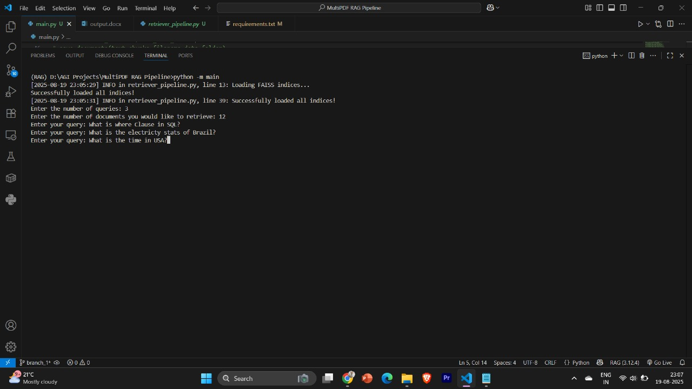
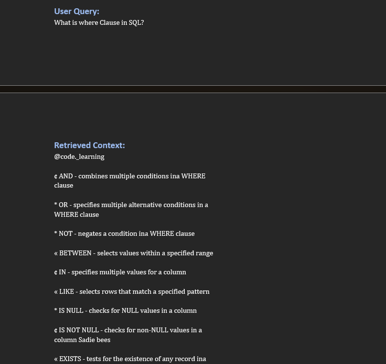
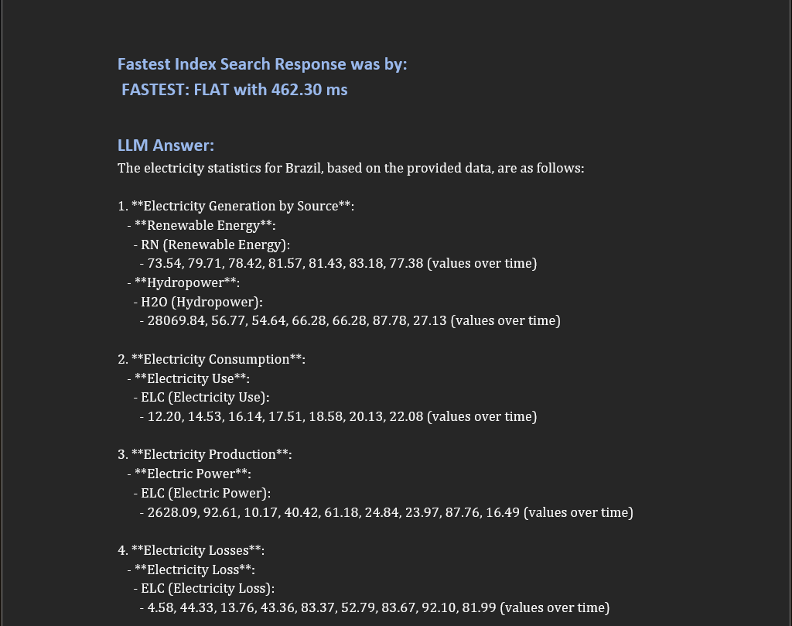
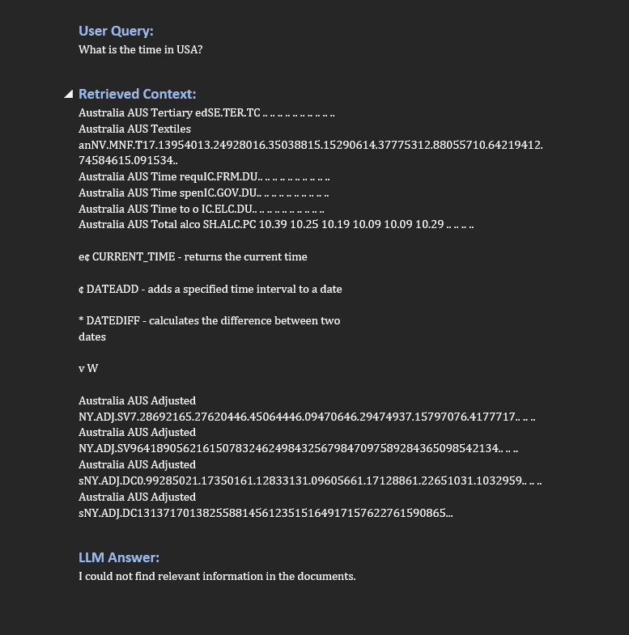
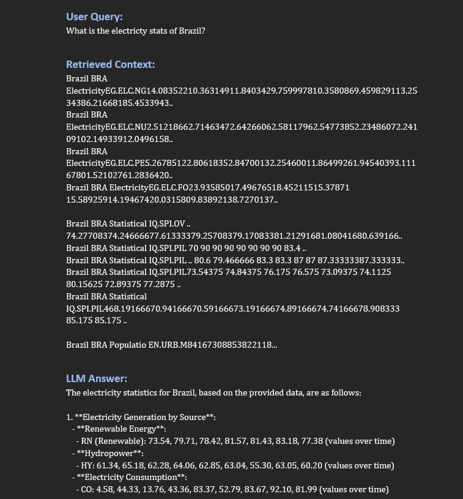

# Multi-PDF RAG Pipeline – Advanced Information Retrieval System  

Multi-PDF RAG Pipeline is an **AI-powered retrieval-augmented generation (RAG) system** that processes multiple types of PDFs (text-heavy, table-heavy, image-heavy), embeds them into a vector database, retrieves contextually relevant information, and generates structured answers.  

The pipeline supports **semantic chunking**, **vector DB indexing (FAISS)**, **reranking (BM25 & MMR)**, and produces final responses in a **DOCX report** for user-friendly consumption.  

---

## Demo Screenshots  

### Sample Input (Query + Dataset)  
  

### DOCX Output (Generated Report)  





---

## Table of Contents  
- [Project Overview](#project-overview)  
- [Features](#features)  
- [Installation](#installation)  
- [Usage](#usage)  
- [Project Structure](#project-structure)  
- [Environment Variables](#environment-variables)  
- [How It Works](#how-it-works)   
- [Requirements](#requirements)  
- [Troubleshooting](#troubleshooting)  

---

## Project Overview  

This project demonstrates how to build a **robust RAG system** that can handle different PDF types:  

- **Text-heavy PDFs** (e.g., Jules Verne’s novel).  
- **Table-heavy PDFs** (World Bank data export).  
- **Image-heavy PDFs** (SQL cheat sheet with embedded text).  

Core tasks:  
- Load PDFs and extract **text, tables, images**.  
- Perform **semantic chunking** for meaningful splits.  
- Generate **embeddings** and store them in a vector database.  
- Test **retrieval accuracy + speed** across multiple index types.  
- Apply **BM25 / MMR reranking** for higher-quality search results.  
- Use an **LLM** to generate grounded answers.  
- Export outputs into a **DOCX report** with references.  

> 🔹 Note: `Vector_DB/Vector_db.ipynb` contains experiments using **MongoDB as a vector database**.  
> The main project uses **FAISS** for vector storage since FAISS offers **more control and indexing options (Flat, HNSW, IVF)**.  

---

## Features  

-  **Multi-PDF Support** – text, tables, and image-based documents.  
-  **Semantic Chunking** – meaningful chunk creation instead of fixed splits.  
-  **Vector Search** – FAISS Flat, HNSW, and IVF indexes tested.  
-  **Performance Testing** – retrieval time vs accuracy measured.  
-  **Reranking** – BM25 & MMR improve results beyond similarity search.  
-  **LLM Integration** – contextual answers grounded in source PDFs.  
-  **DOCX Export** – clean output with answers, summaries, and tables.  
-  **Logging** – detailed logs for debugging & reproducibility.  

---

## Installation  

```bash
git clone https://github.com/your-username/Multi-PDF-RAG-Pipeline.git
cd Multi-PDF-RAG-Pipeline
pip install -r requirements.txt
```
---

## Usage

**Run the Pipeline**

```bash
python main.py
```
---

**Output**

*   Final results will be saved in:

```bash
artifacts/output.docx
```

*   Logs can checked in:

```bash
logs/project.log
```
---

## Project Structure  

```bash
Multi-PDF-RAG-Pipeline/
├── .env
├── .gitignore
├── artifacts/
│   ├── chunked_data/
│   │   ├── images_data_chunk.pkl
│   │   ├── table_data_chunk.pkl
│   │   └── text_data_chunk.pkl
│   ├── loaded_data/
│   │   ├── image_docs.pkl
│   │   ├── table_docs.pkl
│   │   └── text_docs.pkl
│   ├── output.docx
│   └── vector_data/
│       ├── flat_index/
│       ├── hnsw_index/
│       └── ivf_index/
├── Buffer/
├── Chunks/
├── Dataset/
│   ├── journey_to_center.pdf
│   ├── Journey to the center of the Earth.txt
│   ├── 100 SQL COMMANDS .pdf
│   └── P_Data_Extract_From_World_Development_Indicators.pdf
├── Embeddings/
├── loader/
├── logs/
├── main.py
├── requirements.txt
├── Retrievers/
├── utils/
└── Vector_DB/
    ├── indexer.py
    └── Vector_db.ipynb   ← (MongoDB testing)
```

---

## Environment Variables

Create `.env` file in the project root with:

```bash
OPENAI_API_KEY=your_openai_api_key_here
```
---

## How It Works

1.  Load PDFs – extracts text, tables, and images.

2.  Chunking – splits content into semantic units.

3.  Embedding – converts chunks into vectors.

4.  Indexing – stores embeddings in FAISS (Flat, HNSW, IVF).

5.  Retrieval – retrieves relevant chunks for queries.

6.  Reranking – BM25 / MMR refine results.

7.  LLM Generation – grounded answers created.

8.  DOCX Export – final report saved in artifacts/output.docx.

---

## Requirements

*   Python 3.9+

*   OpenAI (Api Key and embedding model)

*   FAISS

*   PyPDF / pdfplumber / tabula (PDF parsing)

*   Pandas

*   python-docx

*   dotenv

*   Requests / httpx

---

## Troubleshooting

*   API key error: Ensure OPENAI_API_KEY is set in .env.

*   No retrieval results: Check embeddings were generated correctly.

*   MongoDB not connecting: Ensure MONGO_URI is active (only needed for Vector_db.ipynb).

*   Output.docx missing: Check logs in logs/project.log.